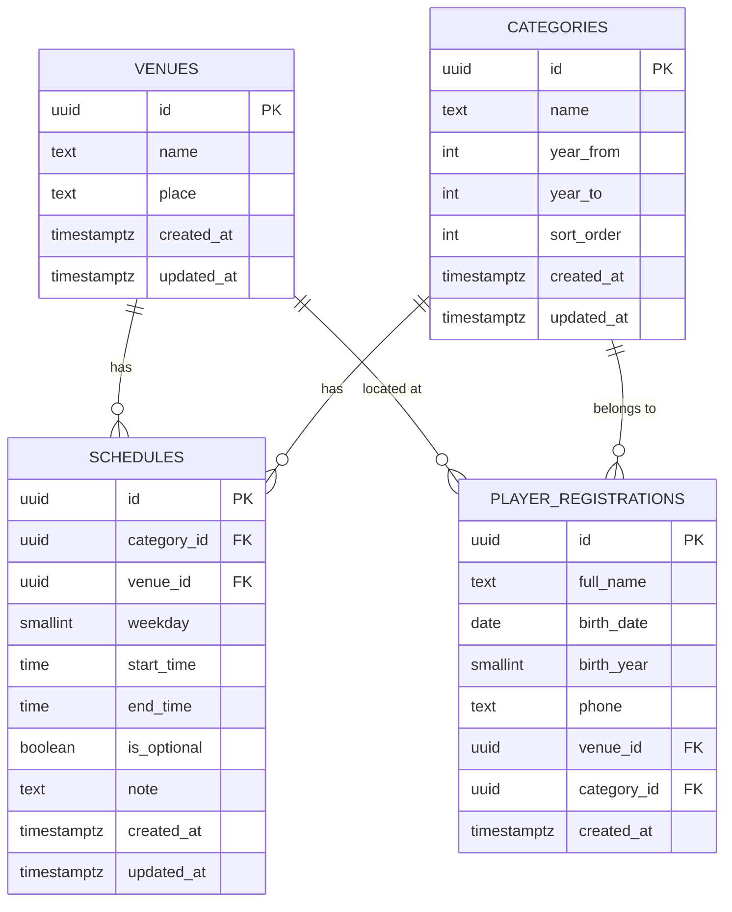

## Overview

The Toluca Altas Montañas database uses PostgreSQL (via Supabase) with four main tables to manage venues, categories, schedules, and player registrations. The schema includes automatic timestamps, generated columns, and referential integrity constraints.

## Database Architecture



## Schema SQL

Run this SQL in your Supabase SQL Editor to create all tables and triggers:

```sql
begin;

-- 0) BORRAR SI YA EXISTE (OJO: elimina datos)
drop table if exists public.player_registrations cascade;
drop table if exists public.schedules cascade;
drop table if exists public.categories cascade;
drop table if exists public.venues cascade;

-- 1) FUNCIÓN + TRIGGERS para updated_at
create or replace function public.set_updated_at()
returns trigger
language plpgsql
as $$
begin
new.updated_at = now();
return new;
end;

$$
;

-- 2) SEDES
create table public.venues (
  id uuid primary key default gen_random_uuid(),
  name text not null,
  place text not null,
  created_at timestamptz not null default now(),
  updated_at timestamptz not null default now(),
  constraint venues_unique unique (name, place)
);

create trigger venues_set_updated_at
before update on public.venues
for each row execute function public.set_updated_at();

-- 3) CATEGORÍAS
create table public.categories (
  id uuid primary key default gen_random_uuid(),
  name text not null unique,
  year_from int not null,
  year_to int not null,
  sort_order int not null default 0,
  created_at timestamptz not null default now(),
  updated_at timestamptz not null default now(),
  constraint categories_year_range check (year_from <= year_to),
  constraint categories_year_limits check (
    year_from between 1900 and (extract(year from now())::int + 1)
    and year_to between 1900 and (extract(year from now())::int + 1)
  )
);

create trigger categories_set_updated_at
before update on public.categories
for each row execute function public.set_updated_at();

-- 4) HORARIOS
create table public.schedules (
  id uuid primary key default gen_random_uuid(),
  category_id uuid not null references public.categories(id) on delete cascade,
  venue_id uuid not null references public.venues(id) on delete cascade,
  weekday smallint not null, -- 1=Lunes ... 7=Domingo
  start_time time not null,
  end_time time not null,
  is_optional boolean not null default false,
  note text,
  created_at timestamptz not null default now(),
  updated_at timestamptz not null default now(),
  constraint schedules_weekday_valid check (weekday between 1 and 7),
  constraint schedules_time_valid check (start_time < end_time),
  constraint schedules_unique unique (category_id, venue_id, weekday, start_time, end_time)
);

create trigger schedules_set_updated_at
before update on public.schedules
for each row execute function public.set_updated_at();

create index schedules_by_category on public.schedules(category_id);
create index schedules_by_venue on public.schedules(venue_id);

-- 5) REGISTROS
create table public.player_registrations (
  id uuid primary key default gen_random_uuid(),
  full_name text not null,
  birth_date date not null,
  birth_year smallint generated always as ((extract(year from birth_date))::smallint) stored,
  phone text not null,
  venue_id uuid not null references public.venues(id) on delete restrict,
  category_id uuid not null references public.categories(id) on delete restrict,
  created_at timestamptz not null default now()
);

create index if not exists idx_player_reg_birth_year on public.player_registrations(birth_year);
create index if not exists idx_player_reg_venue on public.player_registrations(venue_id);
create index if not exists idx_player_reg_category on public.player_registrations(category_id);

commit;
```

<Warning>
  The DROP TABLE commands at the beginning will delete all existing data. Remove these lines if you're updating an existing database.
</Warning>

## Table Definitions

### venues (Sedes)

Stores training venue information.

| Column | Type | Constraints | Description |
|--------|------|-------------|-------------|
| `id` | `uuid` | Primary Key | Auto-generated unique identifier |
| `name` | `text` | Not Null | Venue name (e.g., "Río Blanco") |
| `place` | `text` | Not Null | Full location (e.g., "Río Blanco, Veracruz - Estadio 7 de Enero") |
| `created_at` | `timestamptz` | Not Null, Default now() | Record creation timestamp |
| `updated_at` | `timestamptz` | Not Null, Default now() | Last update timestamp (auto-updated) |

**Unique Constraint:** `(name, place)` - prevents duplicate venues

**Trigger:** Automatically updates `updated_at` on row modification

### categories (Categorías)

Defines age-based player categories using birth year ranges.

| Column | Type | Constraints | Description |
|--------|------|-------------|-------------|
| `id` | `uuid` | Primary Key | Auto-generated unique identifier |
| `name` | `text` | Not Null, Unique | Category name (e.g., "Pony", "Infantil") |
| `year_from` | `int` | Not Null | Starting birth year for category |
| `year_to` | `int` | Not Null | Ending birth year for category |
| `sort_order` | `int` | Not Null, Default 0 | Display order (lower = first) |
| `created_at` | `timestamptz` | Not Null, Default now() | Record creation timestamp |
| `updated_at` | `timestamptz` | Not Null, Default now() | Last update timestamp (auto-updated) |

**Check Constraints:**
- `categories_year_range`: Ensures `year_from <= year_to`
- `categories_year_limits`: Years must be between 1900 and current year + 1

**Trigger:** Automatically updates `updated_at` on row modification

**Example Categories:**
- Dientes de Leche: 2020-2021
- Chupón: 2018-2019
- Biberón: 2016-2017
- Pony: 2014-2015
- Infantil: 2012-2013
- Intermedia: 2010-2011
- Juvenil: 2008-2009

### schedules (Horarios)

Defines training schedules for each category at each venue.

| Column | Type | Constraints | Description |
|--------|------|-------------|-------------|
| `id` | `uuid` | Primary Key | Auto-generated unique identifier |
| `category_id` | `uuid` | Foreign Key, Not Null | References `categories.id` (cascade delete) |
| `venue_id` | `uuid` | Foreign Key, Not Null | References `venues.id` (cascade delete) |
| `weekday` | `smallint` | Not Null | Day of week (1=Monday, 7=Sunday) |
| `start_time` | `time` | Not Null | Training start time |
| `end_time` | `time` | Not Null | Training end time |
| `is_optional` | `boolean` | Not Null, Default false | Whether attendance is optional |
| `note` | `text` | Nullable | Additional notes about the schedule |
| `created_at` | `timestamptz` | Not Null, Default now() | Record creation timestamp |
| `updated_at` | `timestamptz` | Not Null, Default now() | Last update timestamp (auto-updated) |

**Check Constraints:**
- `schedules_weekday_valid`: Weekday must be between 1 and 7
- `schedules_time_valid`: `start_time` must be less than `end_time`

**Unique Constraint:** `(category_id, venue_id, weekday, start_time, end_time)` - prevents duplicate schedules

**Indexes:**
- `schedules_by_category` on `category_id`
- `schedules_by_venue` on `venue_id`

**Trigger:** Automatically updates `updated_at` on row modification

### player_registrations (Registros de Jugadores)

Stores player sign-up information from the landing page.

| Column | Type | Constraints | Description |
|--------|------|-------------|-------------|
| `id` | `uuid` | Primary Key | Auto-generated unique identifier |
| `full_name` | `text` | Not Null | Player's full name |
| `birth_date` | `date` | Not Null | Player's date of birth |
| `birth_year` | `smallint` | Generated (stored) | Auto-calculated from `birth_date` |
| `phone` | `text` | Not Null | Contact phone number |
| `venue_id` | `uuid` | Foreign Key, Not Null | References `venues.id` (restrict delete) |
| `category_id` | `uuid` | Foreign Key, Not Null | References `categories.id` (restrict delete) |
| `created_at` | `timestamptz` | Not Null, Default now() | Registration timestamp |

**Generated Column:** `birth_year` is automatically calculated and cannot be manually inserted

**Foreign Key Behavior:**
- Venue deletion is **restricted** if players are registered there
- Category deletion is **restricted** if players are assigned to it

**Indexes:**
- `idx_player_reg_birth_year` on `birth_year`
- `idx_player_reg_venue` on `venue_id`
- `idx_player_reg_category` on `category_id`

<Note>
  The `birth_year` column is GENERATED ALWAYS. Never include it in INSERT statements - it's calculated automatically from `birth_date`.
</Note>

## Seed Data

After creating the schema, run this SQL to populate initial data:

```sql
begin;

-- SEDES
insert into public.venues (name, place)
values
  ('Río Blanco', 'Río Blanco, Veracruz - Estadio 7 de Enero'),
  ('Jalapilla', 'Jalapilla, Veracruz - Campo Jalapilla')
on conflict (name, place) do nothing;

-- CATEGORÍAS (corregidas)
insert into public.categories (name, year_from, year_to, sort_order)
values
  ('Dientes de Leche', 2020, 2021, 1),
  ('Chupón', 2018, 2019, 2),
  ('Biberón', 2016, 2017, 3),
  ('Pony', 2014, 2015, 4),
  ('Infantil', 2012, 2013, 5),
  ('Intermedia', 2010, 2011, 6),
  ('Juvenil', 2008, 2009, 7)
on conflict (name) do update
set year_from = excluded.year_from,
    year_to = excluded.year_to,
    sort_order = excluded.sort_order;

-- HORARIOS
insert into public.schedules (category_id, venue_id, weekday, start_time, end_time, is_optional, note)
select
  c.id,
  v.id,
  s.weekday,
  s.start_time,
  s.end_time,
  false,
  null
from public.categories c
join public.venues v on v.name in ('Río Blanco', 'Jalapilla')
join (
  values
    ('Río Blanco'::text, 1::smallint, '16:00'::time, '18:00'::time),
    ('Río Blanco'::text, 2::smallint, '16:30'::time, '18:00'::time),
    ('Río Blanco'::text, 3::smallint, '16:00'::time, '18:00'::time),
    ('Jalapilla'::text, 2::smallint, '16:00'::time, '18:00'::time),
    ('Jalapilla'::text, 3::smallint, '16:30'::time, '18:00'::time),
    ('Jalapilla'::text, 4::smallint, '16:00'::time, '18:00'::time)
) as s(venue_name, weekday, start_time, end_time)
  on s.venue_name = v.name
on conflict (category_id, venue_id, weekday, start_time, end_time) do nothing;

commit;
```

This creates:
- **2 venues:** Río Blanco and Jalapilla
- **7 categories:** Age-based from youngest (Dientes de Leche) to oldest (Juvenil)
- **Multiple schedules:** Training times for each venue (weekdays 1-4 represent Monday-Thursday)

## Data Relationships

### One-to-Many Relationships

1. **Venue → Player Registrations**
   - One venue can have many player registrations
   - Delete behavior: `RESTRICT` (cannot delete venue with registered players)

2. **Category → Player Registrations**
   - One category can have many player registrations
   - Delete behavior: `RESTRICT` (cannot delete category with assigned players)

3. **Venue → Schedules**
   - One venue can have many schedules
   - Delete behavior: `CASCADE` (deleting venue removes its schedules)

4. **Category → Schedules**
   - One category can have many schedules
   - Delete behavior: `CASCADE` (deleting category removes its schedules)

### Composite Relationships

Schedules require both a `venue_id` and `category_id`, creating a many-to-many relationship between venues and categories through the schedules table.

## Best Practices

### Inserting Player Registrations

Always omit `birth_year` from INSERT statements:

```sql
-- ✅ Correct
INSERT INTO player_registrations (full_name, birth_date, phone, venue_id, category_id)
VALUES ('Juan Pérez', '2015-05-20', '555-1234', <venue_uuid>, <category_uuid>);

-- ❌ Incorrect - will fail
INSERT INTO player_registrations (full_name, birth_date, birth_year, phone, venue_id, category_id)
VALUES ('Juan Pérez', '2015-05-20', 2015, '555-1234', <venue_uuid>, <category_uuid>);
```

### Updating Records

The `updated_at` field is automatically maintained by triggers. Never set it manually:

```sql
-- ✅ Correct
UPDATE venues SET name = 'New Name' WHERE id = <uuid>;
-- updated_at is automatically set to now()

-- ❌ Unnecessary
UPDATE venues SET name = 'New Name', updated_at = now() WHERE id = <uuid>;
```

### Deleting Protected Records

Before deleting venues or categories with registered players, either:
1. Reassign players to different venues/categories
2. Delete the player registrations first
3. Use CASCADE foreign keys (requires schema modification)

## Querying Examples

### Get all players with venue and category names

```sql
SELECT 
  pr.full_name,
  pr.birth_date,
  pr.phone,
  v.name AS venue_name,
  c.name AS category_name
FROM player_registrations pr
JOIN venues v ON pr.venue_id = v.id
JOIN categories c ON pr.category_id = c.id
ORDER BY pr.created_at DESC;
```

### Get schedules for a specific venue

```sql
SELECT 
  c.name AS category,
  s.weekday,
  s.start_time,
  s.end_time
FROM schedules s
JOIN categories c ON s.category_id = c.id
JOIN venues v ON s.venue_id = v.id
WHERE v.name = 'Río Blanco'
ORDER BY s.weekday, s.start_time;
```

### Count players by category

```sql
SELECT 
  c.name AS category,
  COUNT(pr.id) AS player_count
FROM categories c
LEFT JOIN player_registrations pr ON c.id = pr.category_id
GROUP BY c.name, c.sort_order
ORDER BY c.sort_order;
```

## Migration Notes

If updating from an earlier version:

1. **Backup your data** before running schema changes
2. The schema includes `DROP TABLE` commands - remove these if preserving data
3. Use `ON CONFLICT` clauses in seed data to avoid duplicate errors
4. Test in a development environment first

## Next Steps

- Configure your application's [Environment Variables](/configuration/environment-variables)
- Complete the [Supabase Setup](/configuration/supabase-setup)
- Review the admin panel features for managing this data
