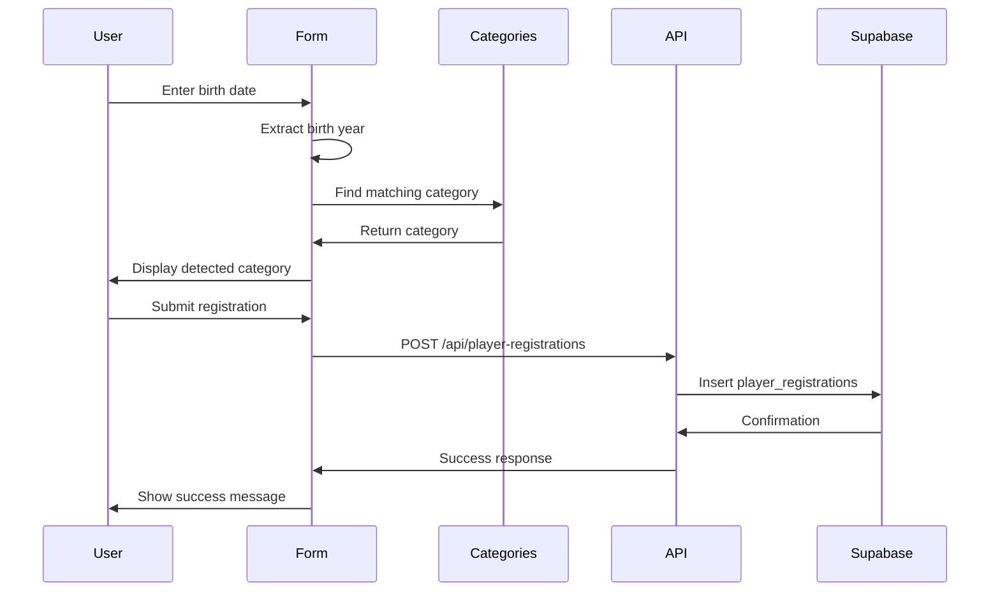

## Overview

The Player Registration feature is the primary entry point for new players to join Toluca Altas Montañas. It provides a public-facing form on the landing page that automatically assigns players to the correct category based on their birth year.

<Note>
  The registration form is fully client-side rendered and integrates directly with Supabase to store player information.
</Note>

## Key Features

<CardGroup cols={2}>
  <Card title="Auto Category Assignment" icon="wand-magic-sparkles">
    Players are automatically assigned to the correct category based on their birth year
  </Card>
  <Card title="Venue Selection" icon="map-pin">
    Players can choose their preferred training venue during registration
  </Card>
  <Card title="Real-time Validation" icon="shield-check">
    Form validates phone numbers (10 digits) and ensures all required fields are completed
  </Card>
  <Card title="WhatsApp Integration" icon="message-circle">
    Phone numbers are normalized and stored for WhatsApp communication
  </Card>
</CardGroup>

## User Workflow

### Step 1: Access the Registration Form

Players navigate to the landing page and scroll to the registration section (ID: `#registro`).

### Step 2: Fill Out Personal Information

The form collects:
- **Full Name**: Player's complete name
- **Birth Date**: Used for automatic category assignment
- **Phone Number**: WhatsApp contact (10 digits)
- **Venue**: Preferred training location

### Step 3: Automatic Category Detection

As soon as the player enters their birth date, the system:
1. Extracts the birth year
2. Finds the matching category using the `findCategory` function
3. Displays the detected category in real-time

```tsx components/player-registration-form.tsx
function findCategory(birthYear: number, cats: Category[]) {
  return cats.find((c) => {
    const min = Math.min(c.year_from, c.year_to);
    const max = Math.max(c.year_from, c.year_to);
    return birthYear >= min && birthYear <= max;
  });
}
```

### Step 4: Phone Number Normalization

Phone numbers are automatically normalized to remove formatting and handle Mexican country codes:

```tsx components/player-registration-form.tsx
function normalizePhone(raw: string) {
  const digits = raw.replace(/\D/g, "");
  if (digits.length === 12 && digits.startsWith("52")) return digits.slice(2);
  return digits;
}
```

### Step 5: Form Submission

When submitted, the form:
1. Validates all required fields
2. Ensures category was found
3. Sends data to `/api/player-registrations` endpoint
4. Displays success or error message

## Component Structure

The registration form is located at `~/workspace/source/components/player-registration-form.tsx`

### Main Component: `PlayerRegistrationForm`

```tsx
export default function PlayerRegistrationForm({
  className,
}: {
  className?: string;
})
```

### State Management

The component manages the following state:

<Tabs>
  <Tab title="Form Data">
    ```tsx
    const [fullName, setFullName] = React.useState("");
    const [birthDate, setBirthDate] = React.useState("");
    const [phone, setPhone] = React.useState("");
    const [venueId, setVenueId] = React.useState("");
    ```
  </Tab>
  <Tab title="Reference Data">
    ```tsx
    const [venues, setVenues] = React.useState<Venue[]>([]);
    const [cats, setCats] = React.useState<Category[]>([]);
    ```
  </Tab>
  <Tab title="UI State">
    ```tsx
    const [loading, setLoading] = React.useState(true);
    const [submitting, setSubmitting] = React.useState(false);
    const [error, setError] = React.useState<string | null>(null);
    const [ok, setOk] = React.useState(false);
    ```
  </Tab>
</Tabs>

## API Integration

### Endpoint: POST `/api/player-registrations`

Location: `~/workspace/source/app/api/player-registrations/route.ts`

The API route:
- Uses Supabase Service Role Key for server-side operations
- Validates all required fields
- Inserts player registration into the database

```typescript app/api/player-registrations/route.ts
export async function POST(req: Request) {
  const body = await req.json();
  const { full_name, birth_date, phone, venue_id, category_id } = body;

  if (!full_name || !birth_date || !phone || !venue_id || !category_id) {
    return NextResponse.json({ error: "Datos incompletos" }, { status: 400 });
  }

  const { error } = await supabase.from("player_registrations").insert({
    full_name,
    birth_date,
    phone,
    venue_id,
    category_id,
  });

  if (error) return NextResponse.json({ error: error.message }, { status: 400 });

  return NextResponse.json({ ok: true });
}
```

## Database Schema

The `player_registrations` table stores:

| Column | Type | Description |
|--------|------|-------------|
| `id` | UUID | Primary key |
| `full_name` | TEXT | Player's complete name |
| `birth_date` | DATE | Birth date for category assignment |
| `phone` | TEXT | WhatsApp phone number (10 digits) |
| `venue_id` | UUID | Foreign key to venues table |
| `category_id` | UUID | Foreign key to categories table |
| `created_at` | TIMESTAMP | Registration timestamp |

## UI Design

The form features a premium dark theme design with:

<CardGroup cols={2}>
  <Card title="Gradient Background" icon="palette">
    Dark gradient with red radial glows for brand consistency
  </Card>
  <Card title="Glassmorphism" icon="glass-water">
    Frosted glass panels with backdrop blur effects
  </Card>
  <Card title="Real-time Feedback" icon="bolt">
    Live category detection display as user types
  </Card>
  <Card title="Responsive Layout" icon="mobile">
    Grid layout adapts from mobile to desktop (lg:grid-cols-5)
  </Card>
</CardGroup>

### Category Detection Display

The form includes a prominent display showing the detected category:

```tsx components/player-registration-form.tsx
<div className="rounded-2xl border border-white/10 bg-black/25 p-4">
  <p className="text-xs font-extrabold tracking-widest text-white/70">
    CATEGORÍA DETECTADA
  </p>
  <p className="mt-2 text-lg font-extrabold text-white">
    {birthYear
      ? category
        ? category.name
        : "No encontrada"
      : "Selecciona tu fecha"}
  </p>
  <p className="mt-1 text-sm text-white/70">
    {birthYear ? `Año: ${birthYear}` : "—"}
  </p>
</div>
```

## Error Handling

<Warning>
  The form includes comprehensive error handling for common registration issues.
</Warning>

Validation errors include:

- Empty full name field
- Missing birth date
- No venue selected
- Category not found for birth year
- Invalid phone number (not 10 digits)

```tsx components/player-registration-form.tsx
if (!cleanName) return setError("Escribe el nombre completo.");
if (!birthDate) return setError("Selecciona la fecha de nacimiento.");
if (!venueId) return setError("Selecciona una sede.");
if (!category) return setError("No se encontró categoría para esa fecha.");
if (cleanPhone.length !== 10)
  return setError("El teléfono debe tener 10 dígitos.");
```

## Success State

After successful registration:

1. Success message displays: "Registro enviado. En breve nos comunicamos por WhatsApp."
2. Form fields are cleared
3. User can submit another registration if needed

## Integration Points

### Landing Page Integration

The form is rendered on the home page at `~/workspace/source/app/page.tsx`:

```tsx app/page.tsx
export default function Home() {
  return (
    <main className="min-h-screen flex flex-col">
      <Hero />
      <AboutSection />
      <TrainingSection />
      <PlayerRegistrationForm />
      <Footer />
    </main>
  );
}
```

### Data Flow



## Next Steps

After registration:

<Steps>
  <Step title="Automatic Category Assignment">
    Player is assigned to the appropriate age category
  </Step>
  <Step title="WhatsApp Confirmation">
    Admin team contacts player via WhatsApp to confirm venue and schedules
  </Step>
  <Step title="Training Instructions">
    Player receives information about their first training session
  </Step>
</Steps>

## Related Documentation

<CardGroup cols={2}>
  <Card title="Admin Dashboard" icon="gauge" href="/features/admin-dashboard">
    View and manage all player registrations
  </Card>
  <Card title="Category Management" icon="tags" href="/features/category-management">
    Configure age categories and year ranges
  </Card>
  <Card title="Venue Management" icon="map-pin" href="/features/venue-management">
    Manage training venues
  </Card>
  <Card title="Database Schema" icon="database" href="/database/tables">
    Complete database structure
  </Card>
</CardGroup>