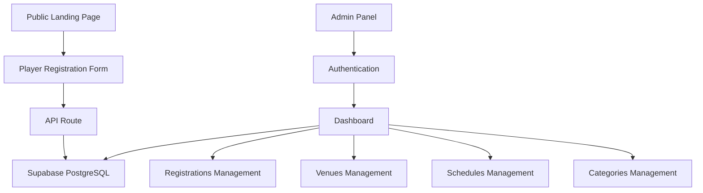

## Overview

Toluca Altas Montañas is a comprehensive sports club management platform designed for football academies and sports organizations. The system provides a public-facing landing page for player registration and a powerful admin panel for managing all aspects of your sports club.

<CardGroup cols={2}>
  <Card title="Quick Start" icon="rocket" href="/quickstart">
    Get up and running in minutes with our quick start guide
  </Card>
  <Card title="Installation" icon="download" href="/installation">
    Step-by-step installation instructions
  </Card>
  <Card title="Admin Dashboard" icon="gauge" href="/features/admin-dashboard">
    Learn about the powerful admin dashboard features
  </Card>
  <Card title="Database Setup" icon="database" href="/configuration/supabase-setup">
    Configure your Supabase database
  </Card>
</CardGroup>

## Key Features

<AccordionGroup>
  <Accordion title="Player Registration" icon="user-plus">
    Public landing page where players can register with their information including name, birth date, phone number, preferred venue, and category selection.
  </Accordion>
  
  <Accordion title="Admin Dashboard" icon="gauge">
    Comprehensive dashboard with KPIs showing total registrations, recent activity (last 30 days), venue distribution, and category breakdown. Features advanced search and filtering capabilities.
  </Accordion>
  
  <Accordion title="Venue Management" icon="map-pin">
    Full CRUD operations for managing training venues with location details. Set up multiple locations across your region.
  </Accordion>
  
  <Accordion title="Schedule Management" icon="calendar">
    Create and manage training schedules for each venue and category combination. Define weekdays, time slots, and optional sessions.
  </Accordion>
  
  <Accordion title="Category Management" icon="tags">
    Organize players by age-based categories (Dientes de Leche, Chupón, Biberón, Pony, Infantil, Intermedia, Juvenil) with automatic year-range assignment.
  </Accordion>
  
  <Accordion title="Data Export" icon="download">
    Export registration data to CSV format for external analysis and reporting.
  </Accordion>
</AccordionGroup>

## Technology Stack

The platform is built with modern web technologies:

- **Next.js** (App Router) - React framework for production
- **Supabase** - Backend-as-a-Service for authentication and PostgreSQL database
- **Tailwind CSS** - Utility-first CSS framework for styling
- **TypeScript** - Type-safe JavaScript
- **Lucide Icons** - Beautiful icon library

## Architecture

## Use Cases

<CardGroup cols={2}>
  <Card title="Football Academies" icon="futbol">
    Manage player registrations and training schedules across multiple venues
  </Card>
  <Card title="Sports Clubs" icon="medal">
    Organize members by age categories and track enrollment
  </Card>
  <Card title="Training Centers" icon="dumbbell">
    Coordinate sessions across different locations and time slots
  </Card>
  <Card title="Youth Programs" icon="child">
    Handle registration and categorization for age-based programs
  </Card>
</CardGroup>

## Getting Support

Need help? Here are your options:

<CardGroup cols={2}>
  <Card title="GitHub Issues" icon="github" href="https://github.com/MeguinE/TolucaFC/issues">
    Report bugs or request features
  </Card>
  <Card title="Documentation" icon="book">
    Browse the complete documentation
  </Card>
</CardGroup>

## Next Steps

Ready to get started? Follow these steps:

<Steps>
  <Step title="Install Dependencies">
    Clone the repository and install all required packages
  </Step>
  <Step title="Configure Supabase">
    Set up your Supabase project and database schema
  </Step>
  <Step title="Set Environment Variables">
    Configure your environment variables for Supabase connection
  </Step>
  <Step title="Run Development Server">
    Start the local development server and access the application
  </Step>
</Steps>

<Card title="Ready to Start?" icon="rocket" href="/quickstart">
  Jump into the quick start guide to get your instance running
</Card>
