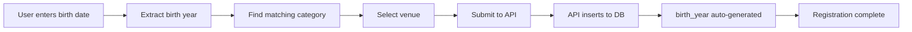

## Overview

This guide will walk you through creating your first player registration using the Toluca Altas Montañas platform. You'll learn how to:

- Set up the Supabase client
- Query venues and categories
- Submit player registrations
- Auto-assign categories based on birth year

<Note>
  Make sure you've completed the [Installation](/installation) steps before proceeding.
</Note>

## Your First Player Registration

Let's build a simple registration flow that automatically assigns players to the correct category based on their birth year.

<Steps>
  <Step title="Initialize the Supabase client">
    Create a client-side Supabase instance to interact with your database:

    ```typescript
    import { createClient } from "@/lib/supabase/client";

    const supabase = createClient();
    ```

    The client helper is already configured in your project at `lib/supabase/client.ts:3-8`:

    ```typescript
    import { createBrowserClient } from "@supabase/ssr";

    export function createClient() {
      return createBrowserClient(
        process.env.NEXT_PUBLIC_SUPABASE_URL!,
        process.env.NEXT_PUBLIC_SUPABASE_PUBLISHABLE_KEY!,
      );
    }
    ```
  </Step>

  <Step title="Fetch venues and categories">
    Load the available venues and categories from the database:

    ```typescript
    const [venues, categories] = await Promise.all([
      supabase
        .from("venues")
        .select("id, name, place")
        .order("name", { ascending: true }),
      supabase
        .from("categories")
        .select("id, name, year_from, year_to, sort_order")
        .order("sort_order", { ascending: true }),
    ]);
    ```

    This returns:
    - **Venues**: Training locations like "Río Blanco" and "Jalapilla"
    - **Categories**: Age groups like "Pony" (2014-2015), "Infantil" (2012-2013), etc.
  </Step>

  <Step title="Auto-assign category based on birth year">
    Match the player's birth year to the appropriate category:

    ```typescript
    function findCategory(birthYear: number, categories: Category[]) {
      return categories.find((c) => {
        const min = Math.min(c.year_from, c.year_to);
        const max = Math.max(c.year_from, c.year_to);
        return birthYear >= min && birthYear <= max;
      });
    }

    // Example: Player born in 2015
    const birthDate = "2015-03-14";
    const birthYear = new Date(birthDate).getFullYear(); // 2015
    const category = findCategory(birthYear, categories.data); // Returns "Pony"
    ```

    <Note>
      Categories are year ranges. A player born in 2015 falls into "Pony" (2014-2015).
    </Note>
  </Step>

  <Step title="Submit the registration">
    Send the registration data to the API route:

    ```typescript
    const response = await fetch("/api/player-registrations", {
      method: "POST",
      headers: { "Content-Type": "application/json" },
      body: JSON.stringify({
        full_name: "Juan Pérez García",
        birth_date: "2015-03-14",
        phone: "2721234567",
        venue_id: "uuid-of-selected-venue",
        category_id: category.id,
      }),
    });

    if (response.ok) {
      console.log("Registration successful!");
    }
    ```

    <Warning>
      Never include `birth_year` in the payload - it's a generated column computed automatically from `birth_date`.
    </Warning>
  </Step>
</Steps>

## Complete Working Example

Here's a full React component that implements the registration flow:

```tsx
"use client";

import { useState, useEffect } from "react";
import { createClient } from "@/lib/supabase/client";
import { Button } from "@/components/ui/button";
import { Input } from "@/components/ui/input";
import { Label } from "@/components/ui/label";

type Venue = { id: string; name: string; place: string | null };
type Category = {
  id: string;
  name: string;
  year_from: number;
  year_to: number;
};

function findCategory(birthYear: number, cats: Category[]) {
  return cats.find((c) => {
    const min = Math.min(c.year_from, c.year_to);
    const max = Math.max(c.year_from, c.year_to);
    return birthYear >= min && birthYear <= max;
  });
}

export default function RegistrationForm() {
  const [venues, setVenues] = useState<Venue[]>([]);
  const [categories, setCategories] = useState<Category[]>([]);
  const [loading, setLoading] = useState(true);

  const [fullName, setFullName] = useState("");
  const [birthDate, setBirthDate] = useState("");
  const [phone, setPhone] = useState("");
  const [venueId, setVenueId] = useState("");

  const [submitting, setSubmitting] = useState(false);
  const [error, setError] = useState<string | null>(null);
  const [success, setSuccess] = useState(false);

  // Load venues and categories on mount
  useEffect(() => {
    async function loadData() {
      const supabase = createClient();

      const [vRes, cRes] = await Promise.all([
        supabase
          .from("venues")
          .select("id, name, place")
          .order("name", { ascending: true }),
        supabase
          .from("categories")
          .select("id, name, year_from, year_to")
          .order("sort_order", { ascending: true }),
      ]);

      if (!vRes.error && !cRes.error) {
        setVenues(vRes.data as Venue[]);
        setCategories(cRes.data as Category[]);
      }

      setLoading(false);
    }

    loadData();
  }, []);

  // Auto-detect category based on birth date
  const birthYear = birthDate ? new Date(birthDate).getFullYear() : null;
  const category = birthYear ? findCategory(birthYear, categories) : null;

  async function handleSubmit(e: React.FormEvent) {
    e.preventDefault();
    setError(null);
    setSuccess(false);

    // Validation
    if (!fullName.trim()) return setError("Enter full name");
    if (!birthDate) return setError("Select birth date");
    if (!venueId) return setError("Select a venue");
    if (!category) return setError("No category found for that birth year");
    if (phone.replace(/\D/g, "").length !== 10) {
      return setError("Phone must be 10 digits");
    }

    setSubmitting(true);

    try {
      const res = await fetch("/api/player-registrations", {
        method: "POST",
        headers: { "Content-Type": "application/json" },
        body: JSON.stringify({
          full_name: fullName.trim(),
          birth_date: birthDate,
          phone: phone.replace(/\D/g, ""),
          venue_id: venueId,
          category_id: category.id,
        }),
      });

      if (!res.ok) throw new Error("Registration failed");

      setSuccess(true);
      setFullName("");
      setBirthDate("");
      setPhone("");
      setVenueId("");
    } catch (err) {
      setError(err instanceof Error ? err.message : "Unknown error");
    } finally {
      setSubmitting(false);
    }
  }

  if (loading) return <p>Loading...</p>;

  return (
    <form onSubmit={handleSubmit} className="space-y-4 max-w-md">
      <div>
        <Label>Full Name</Label>
        <Input
          value={fullName}
          onChange={(e) => setFullName(e.target.value)}
          placeholder="Juan Pérez García"
          required
        />
      </div>

      <div>
        <Label>Birth Date</Label>
        <Input
          type="date"
          value={birthDate}
          onChange={(e) => setBirthDate(e.target.value)}
          required
        />
      </div>

      <div>
        <Label>Phone (WhatsApp)</Label>
        <Input
          value={phone}
          onChange={(e) => setPhone(e.target.value)}
          placeholder="2721234567"
          required
        />
      </div>

      <div>
        <Label>Venue</Label>
        <select
          value={venueId}
          onChange={(e) => setVenueId(e.target.value)}
          className="w-full border rounded px-3 py-2"
          required
        >
          <option value="">Select a venue...</option>
          {venues.map((v) => (
            <option key={v.id} value={v.id}>
              {v.name} — {v.place}
            </option>
          ))}
        </select>
      </div>

      {/* Auto-detected category */}
      {birthYear && (
        <div className="p-4 bg-gray-100 rounded">
          <p className="font-bold">
            Category: {category ? category.name : "Not found"}
          </p>
          <p className="text-sm text-gray-600">Birth year: {birthYear}</p>
        </div>
      )}

      {error && (
        <div className="p-3 bg-red-100 text-red-700 rounded">{error}</div>
      )}

      {success && (
        <div className="p-3 bg-green-100 text-green-700 rounded">
          ✅ Registration successful! We'll contact you via WhatsApp.
        </div>
      )}

      <Button type="submit" disabled={submitting} className="w-full">
        {submitting ? "Submitting..." : "Register Player"}
      </Button>
    </form>
  );
}
```

## How It Works

The registration flow follows this sequence:



## API Route Implementation

The backend API route at `app/api/player-registrations/route.ts:5-42` handles the database insertion:

```typescript
import { NextResponse } from "next/server";
import { createClient } from "@supabase/supabase-js";

export async function POST(req: Request) {
  try {
    const url = process.env.NEXT_PUBLIC_SUPABASE_URL!;
    const serviceKey = process.env.SUPABASE_SERVICE_ROLE_KEY!;

    const supabase = createClient(url, serviceKey, {
      auth: { persistSession: false },
    });

    const { full_name, birth_date, phone, venue_id, category_id } =
      await req.json();

    // Validate required fields
    if (!full_name || !birth_date || !phone || !venue_id || !category_id) {
      return NextResponse.json(
        { error: "Missing required fields" },
        { status: 400 }
      );
    }

    // Insert registration (birth_year is auto-generated)
    const { error } = await supabase.from("player_registrations").insert({
      full_name,
      birth_date,
      phone,
      venue_id,
      category_id,
      // ❌ Never include birth_year - it's generated automatically
    });

    if (error) {
      return NextResponse.json({ error: error.message }, { status: 400 });
    }

    return NextResponse.json({ ok: true });
  } catch (e) {
    return NextResponse.json(
      { error: e instanceof Error ? e.message : "Unknown error" },
      { status: 500 }
    );
  }
}
```

<Note>
  The API uses the **service role key** to bypass Row Level Security (RLS) for public registrations. For authenticated admin operations, use the regular client with RLS enabled.
</Note>

## Database Structure

Here's how the data is organized:

### Tables and Relationships

- **`venues`** - Training locations (Río Blanco, Jalapilla)
- **`categories`** - Age groups with year ranges (Pony, Infantil, etc.)
- **`schedules`** - Training times linked to venues and categories
- **`player_registrations`** - Player data with foreign keys to venues and categories

### Key Features

1. **Auto-generated birth_year**: Computed column that extracts year from `birth_date`
2. **Year-based categories**: Players automatically assigned based on birth year
3. **Foreign key constraints**: Ensures data integrity across tables
4. **Unique constraints**: Prevents duplicate venues and schedules

## Testing Your Setup

<Steps>
  <Step title="Start the development server">
    ```bash
    npm run dev
    ```
  </Step>

  <Step title="Open the landing page">
    Navigate to [http://localhost:3000](http://localhost:3000)
  </Step>

  <Step title="Fill out the registration form">
    - Name: Juan Pérez
    - Birth date: 2015-03-14 (should show "Pony" category)
    - Phone: 2721234567
    - Venue: Select any venue
  </Step>

  <Step title="Submit and verify">
    Check the Supabase dashboard → **Table Editor** → `player_registrations` to see your new entry.
  </Step>
</Steps>

## Common Patterns

### Server-side Supabase Client

For server components or API routes that need authentication:

```typescript
import { createClient } from "@/lib/supabase/server";

// In a Server Component or API route
export async function GET() {
  const supabase = await createClient();

  const { data } = await supabase
    .from("player_registrations")
    .select("*")
    .order("created_at", { ascending: false });

  return Response.json(data);
}
```

### Phone Number Normalization

The form includes phone normalization logic (`components/player-registration-form.tsx:27-31`):

```typescript
function normalizePhone(raw: string) {
  const digits = raw.replace(/\D/g, ""); // Remove non-digits
  if (digits.length === 12 && digits.startsWith("52")) {
    return digits.slice(2); // Remove Mexico country code
  }
  return digits;
}
```

### Category Detection

Automatic category assignment based on year ranges:

```typescript
function findCategory(birthYear: number, cats: Category[]) {
  return cats.find((c) => {
    const min = Math.min(c.year_from, c.year_to);
    const max = Math.max(c.year_from, c.year_to);
    return birthYear >= min && birthYear <= max;
  });
}
```

## Next Steps

<CardGroup cols={2}>
  <Card title="Admin Dashboard" icon="chart-line" href="/admin">
    Manage registrations, venues, and schedules
  </Card>
  <Card title="Database Schema" icon="database" href="/database">
    Deep dive into the data model
  </Card>
  <Card title="Authentication" icon="lock" href="/admin/authentication">
    Set up admin access with Supabase Auth
  </Card>
  <Card title="Deployment" icon="rocket" href="/deployment">
    Deploy to production on Vercel or Netlify
  </Card>
</CardGroup>

## Troubleshooting

### Registration fails with "birth_year must not be included"

This means you're trying to insert `birth_year` manually. Remove it from your insert payload - it's auto-generated.

### Category not found

Check that:
1. You ran the seed data SQL script
2. The birth year falls within a category's year range
3. The `categories` table has data

### "Failed to fetch" errors

Verify your `.env.local` file has correct Supabase credentials and the project is active.

## Learn More

- [Supabase Documentation](https://supabase.com/docs)
- [Next.js App Router](https://nextjs.org/docs/app)
- [Tailwind CSS](https://tailwindcss.com/docs)